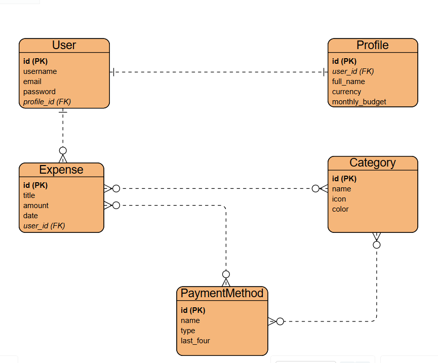

## Backend API Endpoints

### Authentication
| Method | Endpoint | Description |
|--------|----------|-------------|
| POST | /api/auth/signup/ | User signup |
| POST | /api/auth/login/ | User login |
| POST | /api/auth/logout/ | User logout |

### Expenses
| Method | Endpoint | Description |
|--------|----------|-------------|
| GET | /api/expenses/ | List all expenses |
| POST | /api/expenses/ | Create expense |
| GET | /api/expenses/:id/ | Get expense details |
| PUT | /api/expenses/:id/ | Update expense |
| DELETE | /api/expenses/:id/ | Delete expense |

### Categories
| Method | Endpoint | Description |
|--------|----------|-------------|
| GET | /api/categories/ | List all categories |
| POST | /api/categories/ | Create category |
| GET | /api/categories/:id/ | Get category |
| PUT | /api/categories/:id/ | Update category |
| DELETE | /api/categories/:id/ | Delete category |

### Payment Methods
| Method | Endpoint | Description |
|--------|----------|-------------|
| GET | /api/payment-methods/ | List all payment methods |
| POST | /api/payment-methods/ | Create payment method |
| GET | /api/payment-methods/:id/ | Get payment method |
| PUT | /api/payment-methods/:id/ | Update payment method |
| DELETE | /api/payment-methods/:id/ | Delete payment method |

### Profile
| Method | Endpoint | Description |
|--------|----------|-------------|
| GET | /api/profile/ | Get user profile |
| POST | /api/profile/ | Create profile |
| PUT | /api/profile/ | Update profile |

